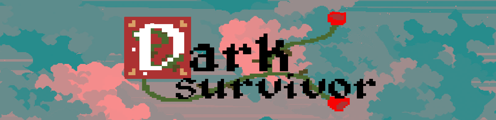

# Dark Survivor
# 

  
  
  

Dark Survivor is a game where your fighting differents waves of various ennemies (3 to be honest). The more your progress, more the ennemies will be **stronger** and **faster**.
 Your objectif is to survive the most waves you can. Every game you playing is different because the map is generated with the Perlin noise and the waves of ennemies are completely random.

## How to play it 

- Download the latest version of Python with [this link](https://www.python.org/downloads/)
- Download this depot using the download button
- Open a terminal in the folder where you have download the depot
- Execute the command `python -m pip install -r requirements.txt` to install the dependencies
- Execute the command  `python main.py` to lunch the programm

## Controls

  
  
  | Button | Action |
  | ------ | ------ |
  | `Z↗S↘Q→D←`| Move the character.|
  | `SPACE` | Role (make you invincible a short moment).  |
  | `Left click` |  Attack (The direction of the attack is based on the position of the mouse).  |
  | `M` | Show the map. |
  |`ESCAPE`| Put the pause menu where you can quit.|
  | `F` | Enable Developer Mod to see more details. |
  | `A` (during Devmod)| Spawn monster.|

